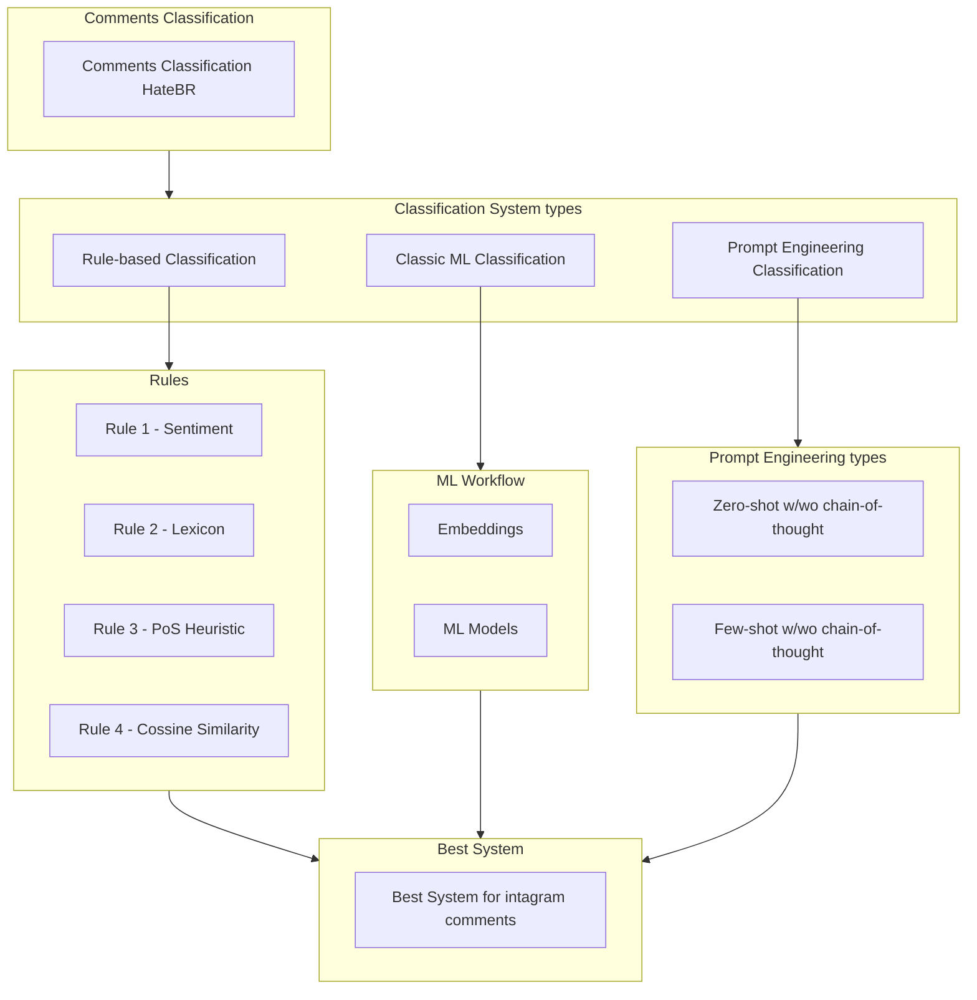

# Speech-Classification-HateBR
NLP for Speech Classification - HateBR HuggingFace Dataset

```mermaid
flowchart TD
    subgraph CommentsClassification[Comments Classification]
        Comments[Comments Classification HateBR]
    end

    subgraph ClassificationSystems[Classification System types]
        direction RL
        RuledBase[Rule-based Classification]
        ML[Classic ML Classification]
        Prompt[Prompt Engineering Classification]
    end

    subgraph Rules [Rules]
        direction RL
        Rule1[Rule 1 - Sentiment]
        Rule2[Rule 2 - Lexicon]
        Rule3[Rule 3 - PoS Heuristic]
        Rule4[Rule 4 - Cossine Similarity]
    end

    subgraph MLWorkflow [ML Workflow]
        direction RL
        Embeddings[Embeddings]
        MLModels[ML Models]
    end

    subgraph PromptEng [Prompt Engineering types]
        direction RL
        Zero[Zero-shot w/wo chain-of-thought]
        Few[Few-shot w/wo chain-of-thought]
    end
    
    subgraph Best [Best System]
        direction RL
        BestSystem[Best System for intagram comments]
    end

    %%Connections
    CommentsClassification --> ClassificationSystems
    RuledBase --> Rules
    ML --> MLWorkflow
    Prompt --> PromptEng
    Rules --> Best
    MLWorkflow --> Best
    PromptEng --> Best
```
