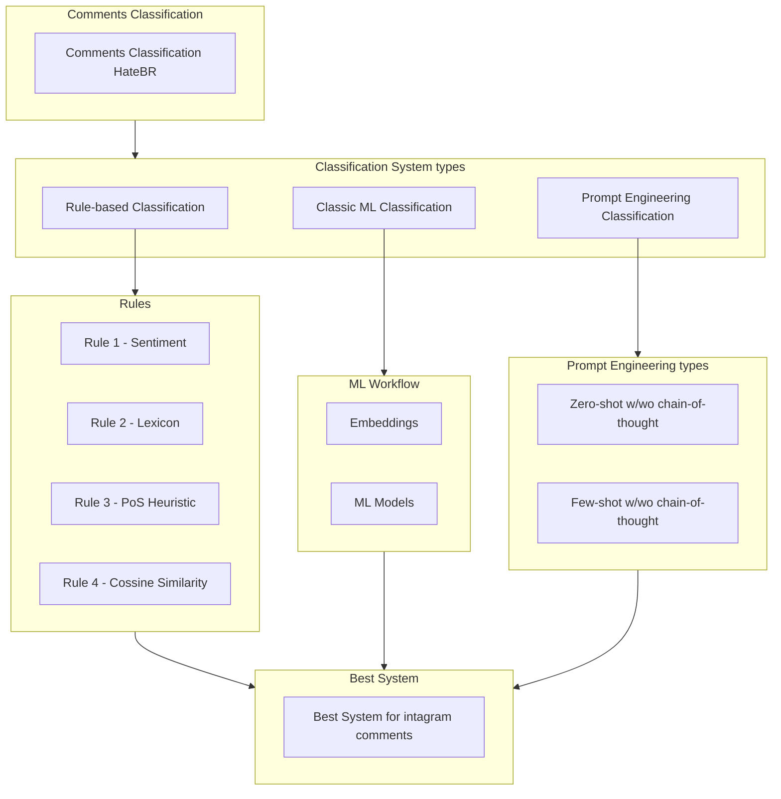

# Instagram Comments Classification | Offensive/Not Offensive categorization 

## Project Description
This project focuses on the automatic classification of Portuguese text, specifically aiming to detect offensive language in Instagram comments. The primary objective is to develop and evaluate systems capable of distinguishing between Offensive and Non-offensive comments.To achieve this, the project implements, tests, and compares three distinct Natural Language Processing (NLP) methodologies: a symbolic rule-based system, a statistical Machine Learning approach, and a generative Prompt Engineering strategy using Large Language Models (LLMs).

## Table of Contents
- [Project Description](#project-description)
- [Project Structure](#project-structure)
- [Dataset](#dataset)
- [Dependencies & Technologies](#dependencies--technologies)
- [Classification Systems](#classification-systems)
- [Best Approach & Conclusion](#best-approach-and-conclusion)
- [License](#license)
- [Authors](#authors)

## Project Structure
The project pipeline explores three parallel branches of text classification methodologies, ultimately comparing them to identify the best-performing system for this specific NLP task. 

## Dataset
The dataset utilized is the HateBR corpus, consisting of comments extracted from posts by Brazilian politicians on Instagram.
* **Characteristics:** The data was manually annotated by three experts. The dataset used for training and testing is perfectly balanced, containing exactly 7,000 comments labeled as either offensive (1) or not offensive (0).
* **Split:** The data was split into 80% for training and 20% for testing across all methodologies to ensure a fair comparison.

## Dependencies & Technologies

Based on the methodologies explored in this project, the following frameworks, libraries, and technologies are utilized:
* **Machine Learning & NLP**: scikit-learn (for vectorizers and classic models like Logistic Regression), gensim (for Word2Vec/Doc2Vec implementations).
* **Hyperparameter Optimization**: optuna.Large Language Models (LLMs): transformers, huggingface_hub, and llama-cpp-python.
* **Utilities**: tqdm (for progress bars), pandas, numpy.

## Classification Systems

This project distinguishes itself by comparing three fundamentally different approaches to text classification:

### 1. Rule-Based Classification

A symbolic system that relies on a pre-processing pipeline and explicit linguistic rules.
* **Methodology:** The pipeline utilizes data analysis to extract features like grammatical functions and sentiment. It classifies text based on three main rules: a strong negative sentiment score, the presence of words from an offensive Portuguese lexicon, and a Part-of-Speech (PoS) heuristic that flags comments with two or more negative adjectives/verbs.Performance: Served as the baseline, achieving an accuracy of 78% and a Macro F1-score of 0.78.
  
### 2.Classic Machine Learning

A statistical approach utilizing supervised learning models and feature engineering to capture textual patterns.
* **Methodology:** Four vectorization methods (Count Vectorizer, TfidfVectorizer, Word2Vec, Doc2Vec) were evaluated alongside three models (Logistic Regression, LinearSVC, MultinomialNB). Hyperparameter optimization was conducted using the Optuna framework.Performance: The best configuration was a Logistic Regression model paired with a Count Vectorizer (with lemmatization), which achieved an accuracy of 85% and an F1-score of 0.85.

### 3. Prompt Engineering (LLMs)

A generative AI approach leveraging the reasoning capabilities of open-source, decoder-only transformer models under 8 billion parameters.
* **Methodology:** Evaluated two models—Qwen 2.5 7B and Llama 3.1 8B—across four prompting techniques: Zero-Shot, Few-Shot, Chain-of-Thought Zero-Shot (CoT-ZS), and Chain-of-Thought Few-Shot (CoT-FS).Performance: The Qwen-7B model using the Few-Shot technique was the definitive best-performing system overall, achieving the highest accuracy of 86% and a Macro F1-score of 86%, while effectively minimizing false negatives.

## Best Approach and Conclusion
After evaluating all three methodologies, the generative AI approach using **Prompt Engineering** emerged as the definitive best-performing system. Specifically, the **Qwen-7B model utilizing the Few-Shot technique** achieved the highest overall performance metrics, including an Accuracy of 86% and a Macro F1-score of 86%. 

While the Logistic Regression model achieved the most significant single reduction in False Negatives, the Qwen Few-Shot model provided the most balanced overall result. It effectively separated the offensive and non-offensive boundaries and kept False Positives to a minimum. This demonstrates the superior potential and generalization capabilities of in-context learning provided by Large Language Models for this specific text classification task.

## License
Distributed under the MIT License. See [LICENSE](LICENSE) for more information.

## Authors
* **Pedro Silva** - pedrosilva222004@gmail.com
* **Ramyad Raadi** - uc2023205631@student.uc.pt

